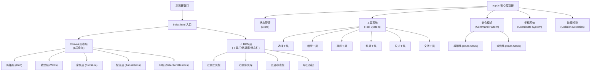

## 1. 架构设计



## 2. 技术描述

- **前端技术栈**：原生 HTML5 + CSS3 + JavaScript (ES6+)，无框架依赖
- **渲染技术**：HTML5 Canvas 2D API，实现高性能分层绘制
- **状态管理**：原生JavaScript对象实现集中式状态管理
- **字体方案**：Google Fonts - DM Sans (标注文字) + DM Mono (坐标数值)
- **图标方案**：内联SVG图标，无第三方图标库依赖
- **构建工具**：无需构建，直接浏览器运行

**技术选型理由**：
1. 纯原生实现保证最轻量级，无需安装依赖，开箱即用
2. Canvas 2D API提供足够的绘制能力和性能支持
3. 命令模式实现撤销重做，操作栈最多保存30步
4. 无构建工具链，降低复杂度，便于维护和部署

## 3. 文件结构

| 文件路径 | 用途 |
|----------|------|
| `/index.html` | 应用入口，DOM结构定义 |
| `/css/style.css` | 全局样式，UI组件样式 |
| `/js/app.js` | 核心控制器，应用入口 |
| `/js/store.js` | 状态管理，数据模型 |
| `/js/coordinates.js` | 坐标系转换，屏幕↔世界坐标 |
| `/js/commands.js` | 命令模式实现，撤销重做 |
| `/js/tools/select.js` | 选择工具实现 |
| `/js/tools/wall.js` | 墙壁工具实现 |
| `/js/tools/room.js` | 房间工具实现 |
| `/js/tools/furniture.js` | 家具工具实现 |
| `/js/tools/dimension.js` | 尺寸工具实现 |
| `/js/tools/text.js` | 文字工具实现 |
| `/js/renderers/gridRenderer.js` | 网格层渲染器 |
| `/js/renderers/wallRenderer.js` | 墙壁层渲染器 |
| `/js/renderers/furnitureRenderer.js` | 家具层渲染器 |
| `/js/renderers/annotationRenderer.js` | 标注层渲染器 |
| `/js/renderers/uiRenderer.js` | UI层渲染器 |
| `/js/data/furnitureLibrary.js` | 家具库数据定义 |
| `/js/utils/collision.js` | 碰撞检测工具 |
| `/js/utils/snap.js` | 网格吸附工具 |
| `/js/utils/export.js` | PNG导出工具 |

## 4. 核心数据模型

### 4.1 世界坐标系
- **单位**：厘米 (cm)
- **网格**：每格10cm × 10cm
- **原点**：画布中心为(0, 0)
- **显示单位**：状态栏转换为米 (m) 显示

### 4.2 物体数据结构

```javascript
// 墙壁 Wall
{
  id: 'wall_xxx',
  type: 'wall',
  x1: 0, y1: 0,      // 起点坐标
  x2: 200, y2: 0,    // 终点坐标
  thickness: 12,     // 厚度(cm)
  rotation: 0,       // 旋转角度
  createdAt: 1234567890
}

// 家具 Furniture
{
  id: 'furniture_xxx',
  type: 'furniture',
  category: 'living', // living/bedroom/kitchen/bathroom
  furnitureType: 'sofa-3',
  x: 100, y: 100,     // 中心点坐标
  width: 200,         // 宽度(cm)
  height: 80,         // 深度(cm)
  rotation: 0,        // 旋转角度(弧度)
  color: '#a8d8ea',   // 填充颜色
  createdAt: 1234567890
}

// 尺寸标注 Dimension
{
  id: 'dim_xxx',
  type: 'dimension',
  x1: 0, y1: 0,
  x2: 200, y2: 0,
  value: 2.0,         // 距离(米)
  createdAt: 1234567890
}

// 文字标注 Text
{
  id: 'text_xxx',
  type: 'text',
  x: 100, y: 100,
  content: '客厅',
  fontSize: 14,
  rotation: 0,
  createdAt: 1234567890
}
```

### 4.3 应用状态

```javascript
{
  // 画布状态
  canvas: {
    width: 1920,
    height: 1080,
    scale: 1,           // 缩放比例
    offsetX: 0,         // X轴偏移
    offsetY: 0,         // Y轴偏移
    gridSize: 10        // 网格大小(cm)
  },
  
  // 工具状态
  currentTool: 'select', // select/wall/room/furniture/dimension/text
  
  // 选中状态
  selection: {
    objectId: null,
    type: null,
    handleType: null,   // resize/rotate/move
    handleIndex: null   // 0-7 控制点索引
  },
  
  // 拖拽状态
  dragState: {
    isDragging: false,
    startX: 0,
    startY: 0,
    startObject: null
  },
  
  // 物体集合
  objects: [],
  
  // 家具库
  furnitureLibrary: { /* 见 furnitureLibrary.js */ },
  
  // 撤销重做
  undoStack: [],
  redoStack: [],
  maxHistory: 30
}
```

## 5. 核心算法

### 5.1 坐标系转换

```javascript
// 屏幕坐标 → 世界坐标
function screenToWorld(screenX, screenY) {
  return {
    x: (screenX - canvas.width/2 - offsetX) / scale,
    y: (screenY - canvas.height/2 - offsetY) / scale
  };
}

// 世界坐标 → 屏幕坐标
function worldToScreen(worldX, worldY) {
  return {
    x: worldX * scale + canvas.width/2 + offsetX,
    y: worldY * scale + canvas.height/2 + offsetY
  };
}
```

### 5.2 矩形包围盒碰撞检测

```javascript
function pointInRect(px, py, rect) {
  // rect: {x, y, width, height, rotation}
  // 需要先将点转换到物体本地坐标系
  const cos = Math.cos(-rect.rotation);
  const sin = Math.sin(-rect.rotation);
  const localX = (px - rect.x) * cos - (py - rect.y) * sin;
  const localY = (px - rect.x) * sin + (py - rect.y) * cos;
  
  return Math.abs(localX) <= rect.width/2 && 
         Math.abs(localY) <= rect.height/2;
}
```

### 5.3 点到线段距离

```javascript
function pointToLineDistance(px, py, x1, y1, x2, y2) {
  const A = px - x1;
  const B = py - y1;
  const C = x2 - x1;
  const D = y2 - y1;
  
  const dot = A * C + B * D;
  const lenSq = C * C + D * D;
  let param = -1;
  
  if (lenSq !== 0) param = dot / lenSq;
  
  let xx, yy;
  if (param < 0) { xx = x1; yy = y1; }
  else if (param > 1) { xx = x2; yy = y2; }
  else { xx = x1 + param * C; yy = y1 + param * D; }
  
  const dx = px - xx;
  const dy = py - yy;
  return Math.sqrt(dx * dx + dy * dy);
}
```

### 5.4 网格吸附

```javascript
function snapToGrid(value, gridSize) {
  return Math.round(value / gridSize) * gridSize;
}
```

## 6. 命令模式 (撤销重做)

### 6.1 命令接口

```javascript
class Command {
  execute() {}
  undo() {}
}

class CreateObjectCommand extends Command {
  constructor(object) {
    super();
    this.object = object;
  }
  execute() { store.addObject(this.object); }
  undo() { store.removeObject(this.object.id); }
}

class DeleteObjectCommand extends Command {
  constructor(objectId) {
    super();
    this.objectId = objectId;
    this.object = null;
  }
  execute() { 
    this.object = store.getObject(this.objectId);
    store.removeObject(this.objectId); 
  }
  undo() { store.addObject(this.object); }
}

class MoveObjectCommand extends Command {
  constructor(objectId, dx, dy) {
    super();
    this.objectId = objectId;
    this.dx = dx;
    this.dy = dy;
  }
  execute() { store.moveObject(this.objectId, this.dx, this.dy); }
  undo() { store.moveObject(this.objectId, -this.dx, -this.dy); }
}
```

### 6.2 命令管理器

```javascript
class CommandManager {
  constructor(maxHistory = 30) {
    this.undoStack = [];
    this.redoStack = [];
    this.maxHistory = maxHistory;
  }
  
  execute(command) {
    command.execute();
    this.undoStack.push(command);
    this.redoStack = [];
    if (this.undoStack.length > this.maxHistory) {
      this.undoStack.shift();
    }
  }
  
  undo() {
    if (this.undoStack.length === 0) return;
    const command = this.undoStack.pop();
    command.undo();
    this.redoStack.push(command);
  }
  
  redo() {
    if (this.redoStack.length === 0) return;
    const command = this.redoStack.pop();
    command.execute();
    this.undoStack.push(command);
  }
}
```

## 7. 性能优化

1. **分层渲染**：使用多层Canvas，仅重绘变化的层
2. **脏矩形**：记录需要重绘的区域，避免全画布重绘
3. **requestAnimationFrame**：统一渲染循环，保证60fps
4. **事件节流**：鼠标移动事件节流，减少计算量
5. **对象池**：复用临时计算对象，减少GC压力
